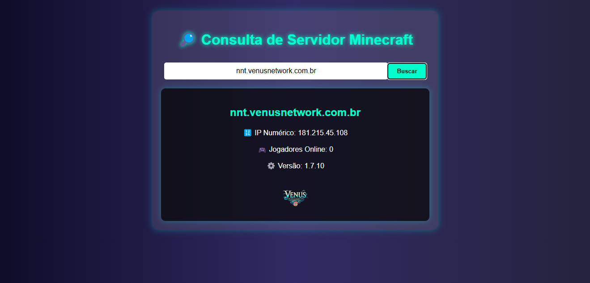

# 🔎 Consulta de Servidor Minecraft  

Este projeto é um front-end React.js que consome a API [mcsrvstat.us](https://api.mcsrvstat.us/) para exibir informações de servidores Minecraft.  

## 🚀 Funcionalidades
✅ Buscar informações de qualquer servidor pelo IP ou domínio  
✅ Exibir IP numérico, versão do servidor, jogadores online e ícone  
✅ Totalmente responsivo  

## 🛠️ Como rodar o projeto

1️⃣ Clone o repositório:  
```bash
git clone https://github.com/HiginoFernando/API-Minecraft.git
cd API-Minecraft

2️⃣ Instale as dependências:
npm install

3️⃣ Rode o projeto:
npm run dev

```

📡 API utilizada
https://api.mcsrvstat.us/

